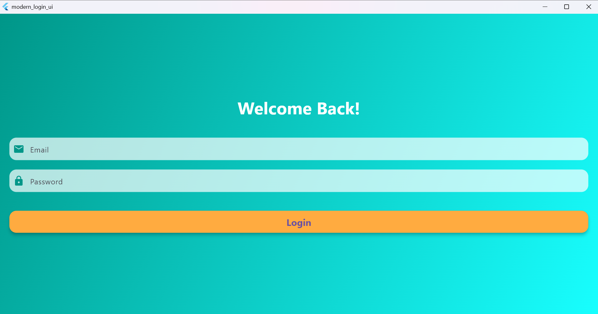

# Modern Login UI

Project ini merupakan contoh **aplikasi Flutter dengan tampilan login modern (Modern Login UI)**.  
Dibuat sebagai **tugas praktikum** atau **proyek latihan** untuk mempelajari desain antarmuka (UI) menggunakan **Flutter**.

---

## 🎯 Tujuan
- Memahami struktur dasar project Flutter.  
- Mempelajari penggunaan widget untuk membangun tampilan login.  
- Melatih keterampilan desain antarmuka modern menggunakan Flutter.

---

## 🧩 Teknologi yang digunakan
- **Flutter** (Framework utama)  
- **Dart** (Bahasa pemrograman)  
- **Material Design Components**

---

## 📸 Tampilan Aplikasi
Berikut hasil tampilan antarmuka login yang telah dibuat:

---

## 👨‍💻 Anggota Kelompok
| Nama Lengkap         | NIM        |
|----------------------|------------|
| **Caca Cahyadi**     | 232101058  |
| **Rahmat Hardiansyah** | 232101072 |
| **Aqilla Yufaridza** | 232101079  |

---

> 💡 *Project ini dibuat untuk memenuhi tugas “Making App with Basic Widget” pada mata kuliah Mobile Programming2.*
